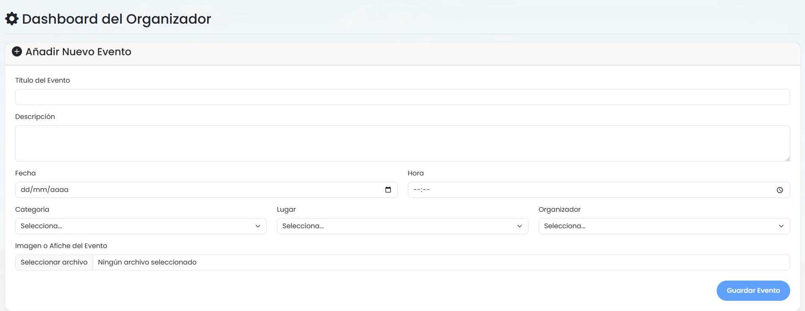

# Arequipa Hoy: Plataforma de Centralización de Eventos Locales

Este repositorio contiene el código fuente y la documentación del proyecto "Arequipa Hoy", una plataforma web desarrollada para centralizar y facilitar el acceso a eventos locales en la ciudad de Arequipa, Perú. El proyecto surge como una solución a la fragmentación informativa que dificulta el descubrimiento de actividades culturales, sociales y recreativas.

## Resumen del Proyecto

La plataforma se ha diseñado para servir como un punto de encuentro digital entre los organizadores de eventos y los ciudadanos. Su objetivo principal es reducir el "ruido informativo" y mejorar la visibilidad de la oferta cultural local, proporcionando un espacio único y accesible donde los usuarios pueden descubrir eventos y los organizadores pueden difundir sus actividades de manera efectiva.

## Características Principales

*   **Centralización de Eventos:** Ofrece un catálogo unificado de actividades, eliminando la necesidad de buscar en múltiples fuentes de información dispersas.
*   **Arquitectura de Roles:**
    *   **Usuario Estándar:** Permite a los usuarios explorar, buscar y recibir notificaciones sobre eventos de su interés.
    *   **Usuario Organizador:** Provee un panel de administración privado para publicar, gestionar y dar seguimiento a sus propios eventos.
*   **Autenticación Segura:** Implementa un sistema de registro y acceso seguro mediante el uso de JSON Web Tokens (JWT) para proteger las cuentas y los datos de los usuarios.
*   **Panel de Administración (Dashboard):** Interfaz dedicada para organizadores que permite la gestión completa del ciclo de vida de un evento (CRUD: Crear, Leer, Actualizar, Borrar).
*   **Notificaciones Automatizadas:** Sistema de envío de recordatorios por correo electrónico para asegurar que los usuarios no olviden los eventos a los que planean asistir.
*   **Generación de Reportes en PDF:** Funcionalidad que permite a los usuarios descargar la información detallada de un evento en formato PDF para consulta y distribución offline.

## Arquitectura y Tecnologías Utilizadas

El sistema se basa en una arquitectura de software desacoplada, lo que garantiza la escalabilidad, mantenibilidad y permite el desarrollo paralelo de sus componentes. La comunicación entre el cliente y el servidor se realiza a través de una API REST.

*   **Frontend:** Desarrollado en **Angular** como una Single-Page Application (SPA) para una experiencia de usuario fluida y dinámica.
*   **Backend:** Construido con **Django** y **Django REST Framework**, utilizando Python para una lógica de negocio robusta, segura y escalable. Sigue el patrón arquitectónico Modelo-Vista-Controlador (MVC).
*   **Base de Datos:** Se utiliza **SQLite** para la gestión de datos en el entorno de desarrollo, por su simplicidad y ligereza.
*   **API:** Interfaz **RESTful** que utiliza el formato **JSON** para un intercambio de información estandarizado y eficiente entre el frontend y el backend.

### Diagrama de la Arquitectura del Sistema
.

## Vistas de la Aplicación

**Formulario de Registro**
.
*Descripción: Interfaz para la creación de nuevas cuentas de usuario, permitiendo la selección entre rol de "Usuario" u "Organizador".*

**Página Principal de Eventos (Home)**
.
*Descripción: Galería de eventos presentados en formato de tarjetas. Es la vista principal para los usuarios autenticados.*

**Panel de Administración del Organizador (Dashboard)**
.
*Descripción: Panel privado que permite a los organizadores publicar nuevos eventos y gestionar los existentes.*

## Autores del Proyecto

Este proyecto fue desarrollado por estudiantes de la **Universidad Nacional de San Agustín (UNSA)**, Arequipa, Perú.

*   **Giovanni Patrick Mejia Rondan** (`gmejiar@unsa.edu.pe`)
*   **German Arturo Chipana Jeronimo** (`gchipanaj@unsa.edu.pe`)
*   **Santiago Enrique Palma Apaza** (`spalmaa@unsa.edu.pe`)
*   **Leonardo Juan Jose Baca Calsin** (`lbacac@unsa.edu.pe`)

## Líneas de Desarrollo Futuras

El trabajo futuro se centrará en la implementación de las siguientes funcionalidades para enriquecer la plataforma:

*   **Integración de Geolocalización:** Implementación de mapas interactivos para visualizar eventos según la proximidad del usuario.
*   **Sistema de Recomendación Personalizado:** Desarrollo de un motor basado en aprendizaje automático para sugerir eventos relevantes a los intereses de cada usuario.
*   **Mejora de Funcionalidades de Búsqueda:** Incorporación de filtros avanzados por rangos de fecha, categorías anidadas y otros atributos.
*   **Desarrollo de una Aplicación Móvil Nativa:** Creación de versiones para iOS y Android para extender el alcance y la accesibilidad de la plataforma.

## Videos

* Giovanni Mejia:
   *    **Teoria:**
      *    **https://youtu.be/IvgTi-FSTGI**
      *    **https://youtu.be/KaaSMzIiC9Q**

   *    **Laboratorio:**
        **https://youtu.be/GpjoJX0uk1o**
        **https://youtu.be/t_HyhGVKyzs**

* German Chipana:
   *    **Teoria:**
      *    **https://youtu.be/y8zh8u--EKQ**
      *    **https://youtu.be/d1PVveJbFis**

   *    **Laboratorio:**
        **https://youtu.be/qgyk8m-qsd4**

## Coevaluación:
* Giovanni:
   * **Palma Apaza Santiago Enrique: 25%** 
   * **Baca Calsin Leonardo Juan Jose: 25%** 
   * **German Arturo Chipana Jeronimo: 25%**

* German:
   * **Palma Apaza Santiago Enrique: 25%** 
   * **Baca Calsin Leonardo Juan Jose: 25%** 
   * **Mejia Rondan Giovanni Patrick: 25%**
